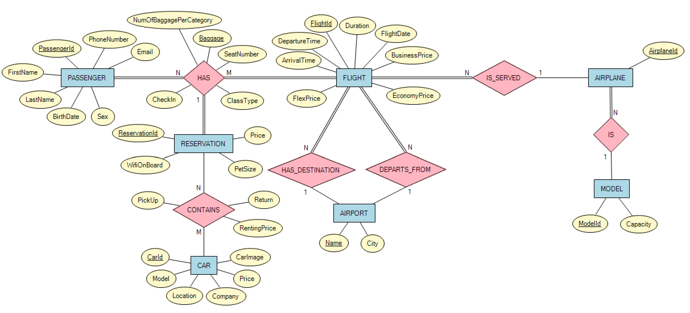
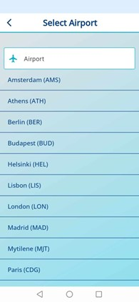
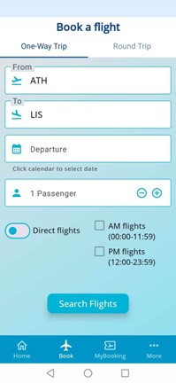
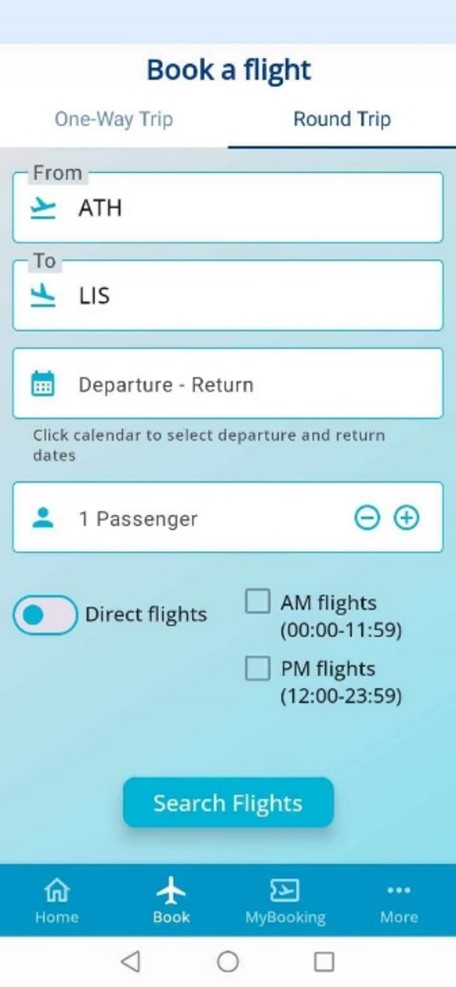
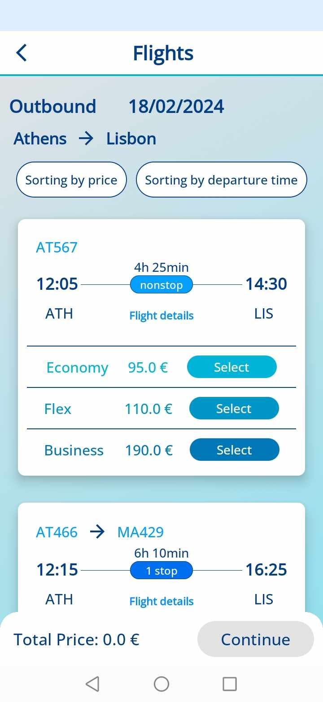
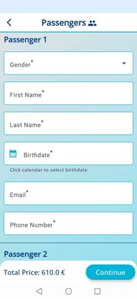
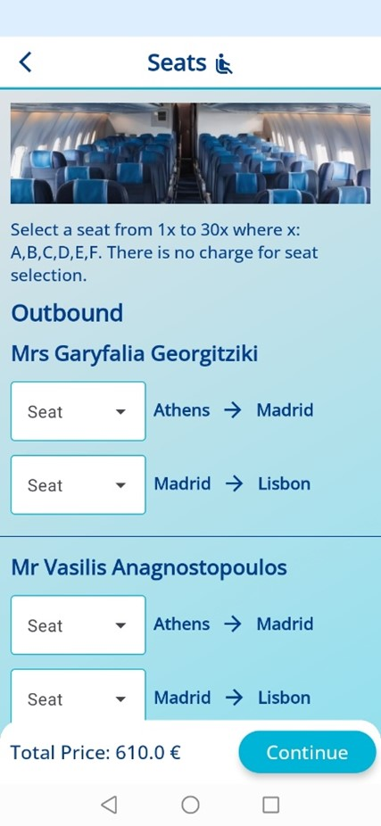
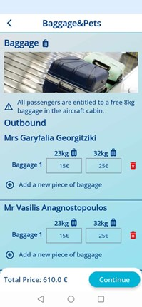
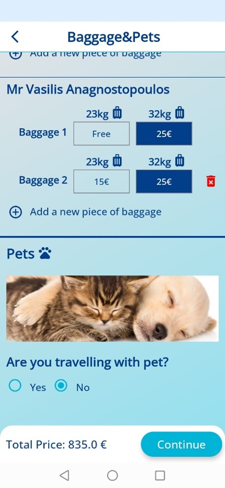

# FlyNowApp Airline Android App

FlyNowApp is an Android application developed using Jetpack Compose in Android Studio, with a Node.js server as its backend, communicating with a PostgreSQL database. This application allows users to efficiently manage reservations, seating, luggage, pets, and car rentals. Users can handle booking details, make cancellations, and check-in for flights.

## Table of Contents

- [Installation](#installation)
- [Features](#features)
- [Technologies Used](#technologies-used)
- [Setup](#setup)
  - [Android Studio](#android-studio)
  - [Node.js Server](#nodejs-server)
  - [PostgreSQL Database](#postgresql-database)
- [Usage](#usage)
- [Backend](#backend)
- [ER Diagram](#er-diagram)
- [Screenshots From The Screens Of The App](#screenshots-from-the-screens-of-the-app)

## Installation

Clone the repository to your local machine:

`git clone https://github.com/vasilisanagno/FlyNow-Airline-Android-App.git`

## Features

- Manage passenger information
- Make reservations and cancellations
- Check-in for flights
- View and manage flight details
- Handle seating, luggage, pets, car rentals, class type of flight in reservation and wifi on board

## Technologies Used

- Android Studio with Jetpack Compose
- Node.js for the backend server
- PostgreSQL for the database
- Volley Library for Android backend communication

## Setup

### Android Studio

1. Open the `FlyNowApp` folder in Android Studio.
2. Build and run the Android application on an emulator or a physical device.

### Node.js Server

1. Navigate to the `backend` folder.
2. Install the required Node.js packages: `npm install`

3. Start the server: `npm start`

### PostgreSQL Database

1. Ensure PostgreSQL is installed on your machine.
2. Navigate to the `creationOfDatabase` folder: `cd creationOfDatabase`
3. Execute the Python script to initialize the database: `python3 creationOfDatabase.py`

## Usage

- Launch the FlyNowApp on your Android device or emulator.
- Explore the various features for managing reservations, flights, and other details.

## Backend

The backend for FlyNowApp is implemented using Node.js. The `server.js` file contains the code for handling server-side logic, communication with the PostgreSQL database, and serving requests from the Android application.

To run the backend, follow the instructions in the [Setup](#setup) section.

## ER Diagram

The ER diagram provides an overview of the database schema, illustrating the relationships between different entities such as passenger information, reservations, flights, airports, aircraft models, seating, luggage, pets, and car rentals.

ER Diagram:

## Screenshots From The Screens Of The App

  
  
  
  

 

 

 