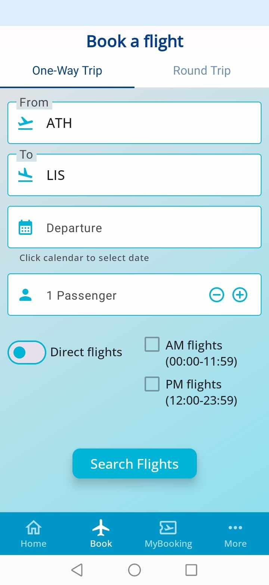
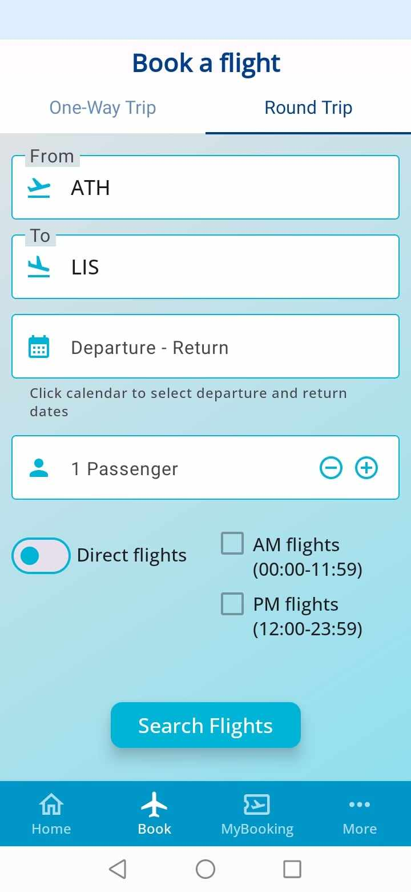
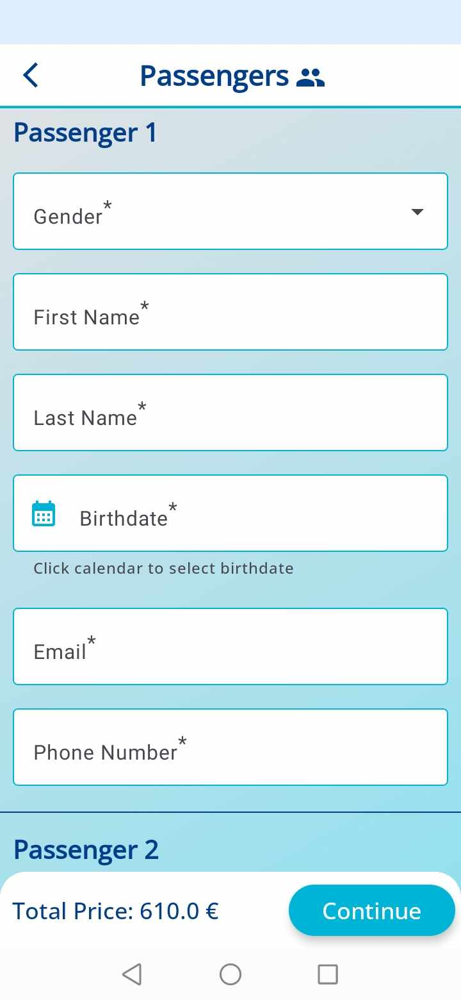
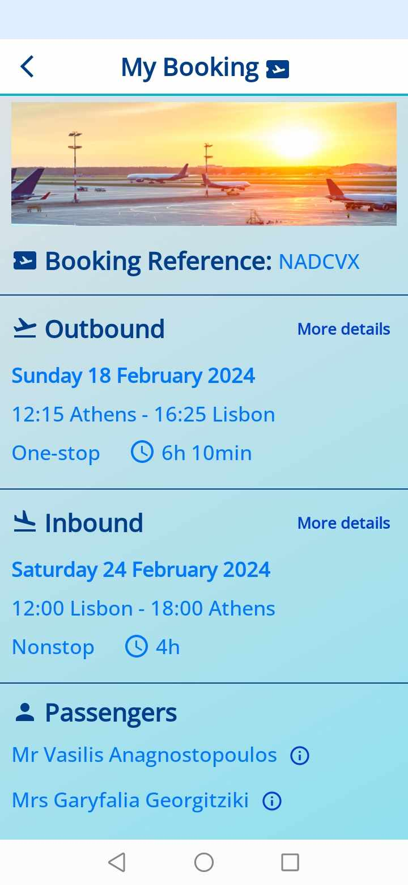
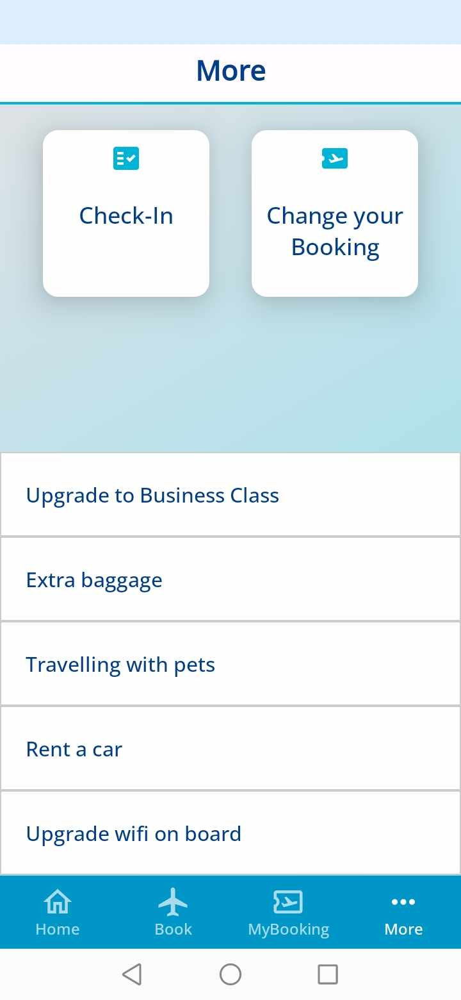
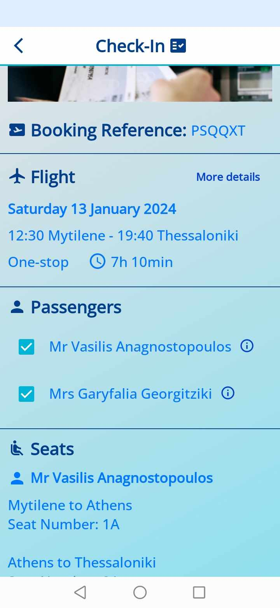
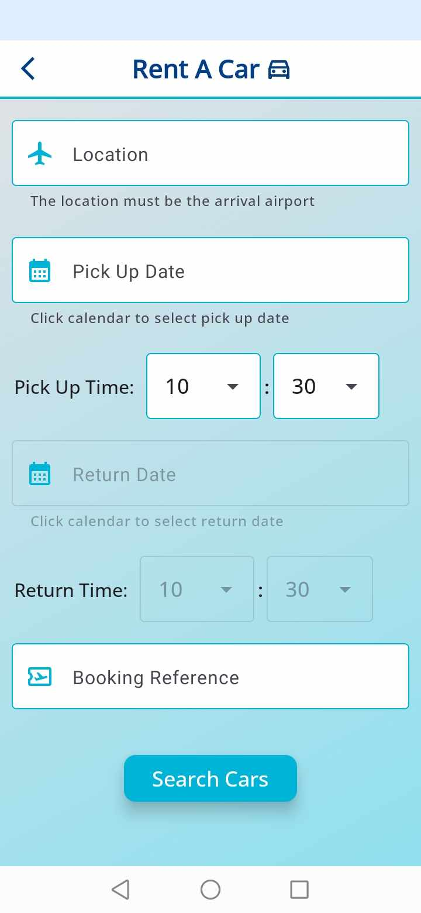
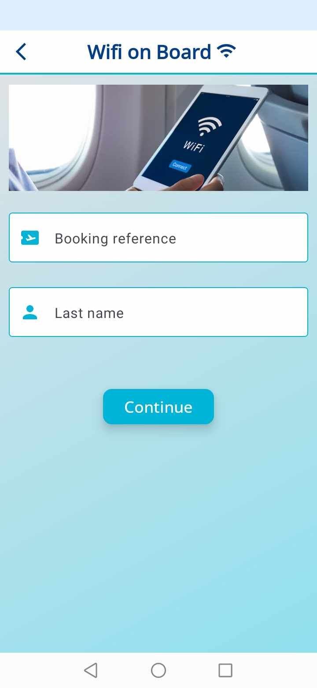

# FlyNowApp Airline Android App

FlyNowApp is an Android application developed using Jetpack Compose in Android Studio, with a Node.js server as its backend, communicating with a PostgreSQL database. This application allows users to efficiently manage reservations, seating, luggage, pets, and car rentals. Users can handle booking details, make cancellations, and check-in for flights.

## Table of Contents

- [Installation](#installation)
- [Features](#features)
- [Technologies Used](#technologies-used)
- [Folder Structure](#folder-structure)
- [Setup](#setup)
  - [Android Studio](#android-studio)
  - [Node.js Server](#nodejs-server)
  - [PostgreSQL Database](#postgresql-database)
- [Usage](#usage)
- [Backend](#backend)
- [ER Diagram](#er-diagram)
- [Screenshots From The Screens Of The App](#screenshots-from-the-screens-of-the-app)

## Installation

Clone the repository to your local machine:

`git clone https://github.com/vasilisanagno/FlyNow-Airline-Android-App.git`

## Features

- Manage passenger information
- Make reservations and cancellations
- Check-in for flights
- View and manage flight details
- Handle seating, luggage, pets, car rentals, class type of flight in reservation and wifi on board

## Technologies Used

- Android Studio with Jetpack Compose
- Node.js for the backend server
- PostgreSQL for the database
- Volley Library for Android backend communication

## Folder Structure

The project has the following backend folder structure:

- `backend`: Contains server-related files.
  - `src/server.js`: Main server file.
  - `src/config`: Folder that configurates the connection of the database with the server.
  - `src/api`: Folder that contains files for the routes and communication with the database.
    - `controllers`: Functions that are called according to the routes.
    - `utils`: Functions that are useful some of them for the sockets and the game board.
    - `routes`: Defines API routes that exists in the server.
    - `services`: Functions that communicates with the database and makes queries.
- `creationOfDatabase`: Contains files related to the initialization of the database with random data.

The project has the following frontend folder structure:

- `FlyNowApp`: Contains frontend-related files.
  - `src/main`: Contains the source code.
    - `java/com/example/flynow`: All files with code.
      - `data`: Files related to communication with the server.
        - `model`: Data classes that are useful in the responses of the server.
        - `network`: Communication(APIs) with the server.
        - `repository`: Classes that process the responses from the server apis.
      - `di`: Folder for dependency injection.
      - `model`: Data classes that are useful in entire app.
      - `navigation`: Files related to the navigation throughout the app.
      - `ui`: Files related to the screens of the app.
        - `components`: Components that used on multiple screens.
        - `screens`: Files related to the screens of the app and each screen, if needed, 
        has a view model class and its own components.
      - `utils`: Functions and constants that are useful in the functionalities of the app.

## Setup

### Android Studio

1. Open the `FlyNowApp` folder in Android Studio.
2. Build and run the Android application on an emulator or a physical device.

### Node.js Server

1. Navigate to the `backend` folder.
2. Install the required Node.js packages: `npm install`

3. Start the server: `npm start`

### PostgreSQL Database

1. Ensure PostgreSQL is installed on your machine.
2. Navigate to the `creationOfDatabase` folder: `cd creationOfDatabase`
3. Execute the Python script to initialize the database: `python creationOfDatabase.py`

## Usage

- Launch the FlyNowApp on your Android device or emulator.
- Explore the various features for managing reservations, flights, and other details.

## Backend

The backend for FlyNowApp is implemented using Node.js. The `backend` folder contains the code for handling server-side logic, communication with the PostgreSQL database, and serving requests from the Android application.

To run the backend, follow the instructions in the [Setup](#setup) section.

## ER Diagram

The ER diagram provides an overview of the database schema, illustrating the relationships between different entities such as passenger information, reservations, flights, airports, aircraft models, seating, luggage, pets, and car rentals.

ER Diagram:

## Screenshots From The Screens Of The App

  
  
  
  

  
  
  
  

  
  
  
  

  
  
  
  

  
  
  
  

  
  
  
  

